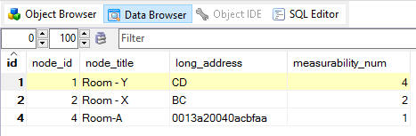
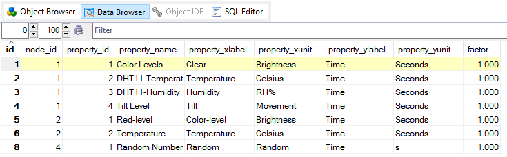
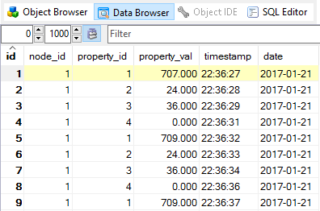
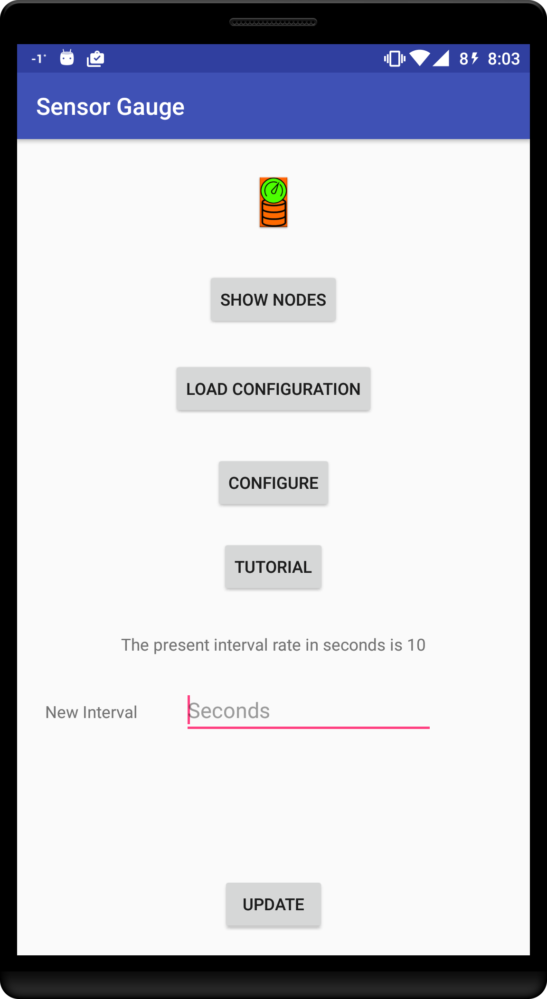
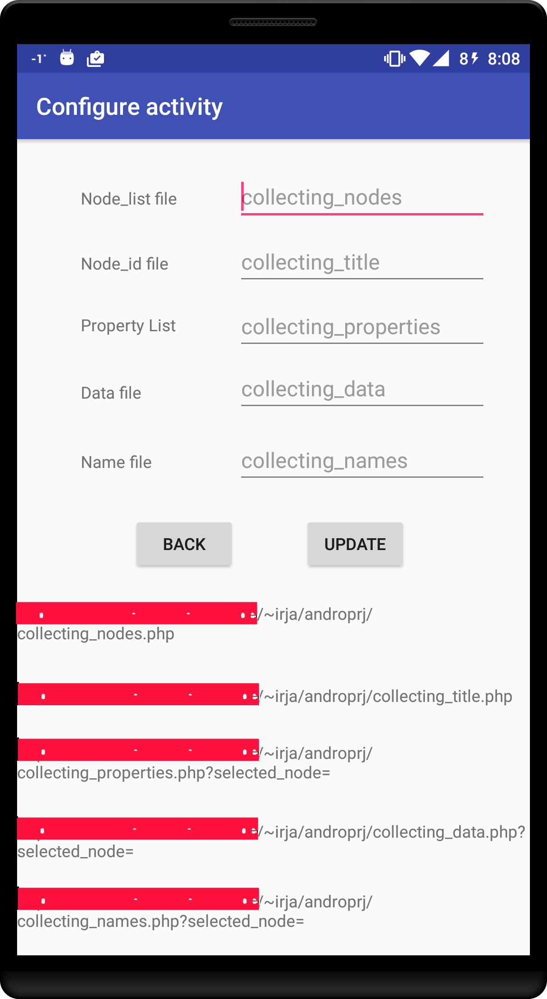
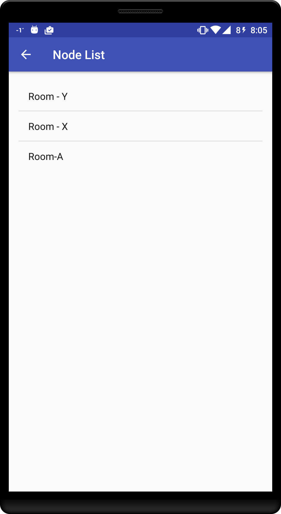
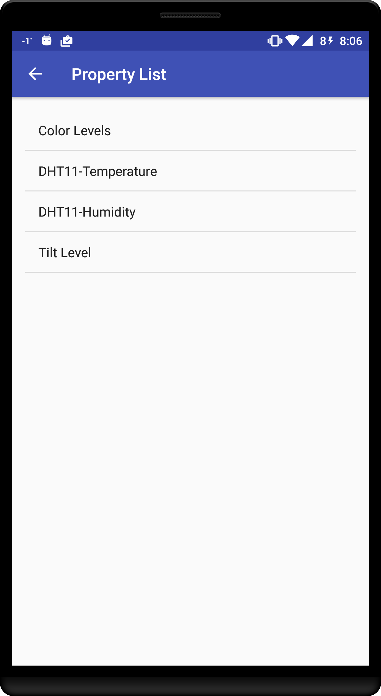
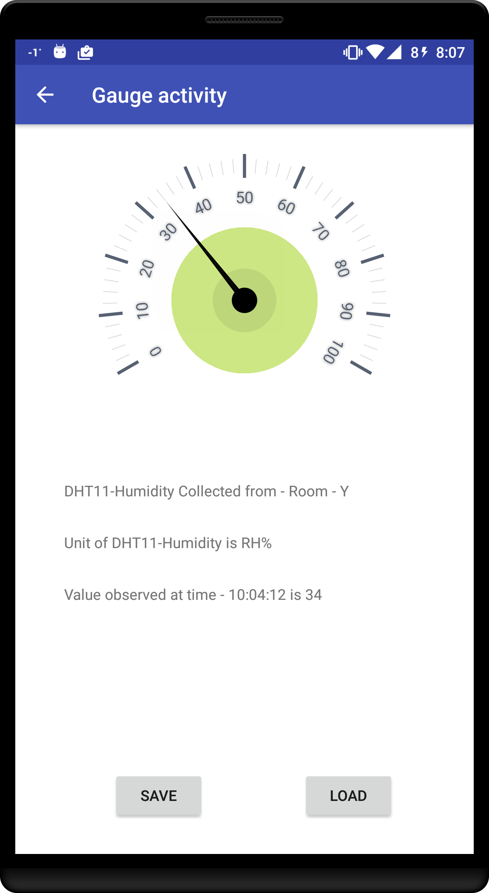
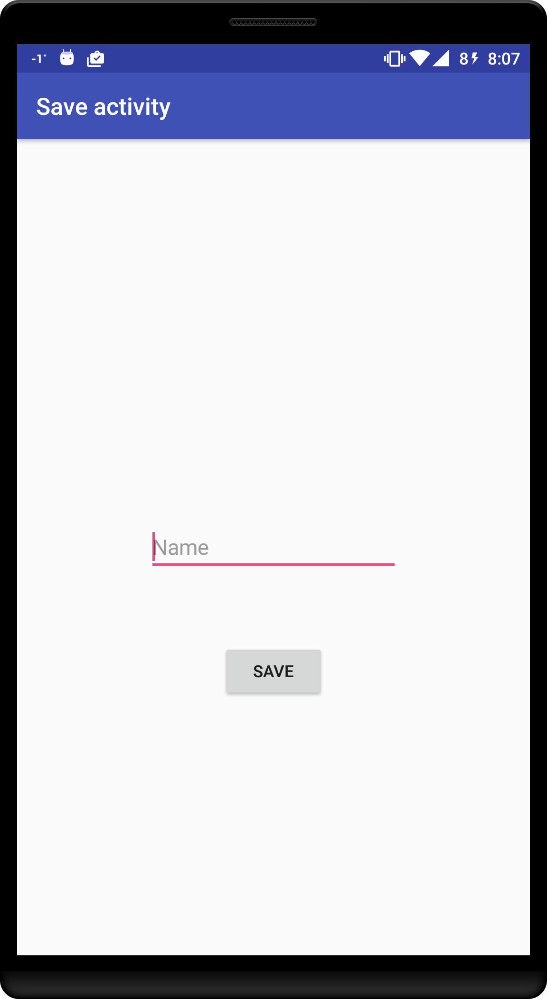

# SensorGauge
Android App to visualize stored sensor data from private MySQL databases

Makers, Electronic hobbyists/hackers propbably have numerous sensors lying around in their toolbox.

This Android app motivates them to register those sensor's values into a MySQL database.

When you need to visualize the data from your personal sensor network, open up the app and Voila.. You have them in a graphical portrayal.

The successful operation of this app requires the user to link the App to PHP scripts parked on a WebServer.( I know !! Some people dont like this.. But my project uses this process !!)

The App expects your MySQL database to contain three seperate tables to hold the sensor information. The structure of each of them is shown below.

Master Table.. This is where your sensor node's name and other details are stored.

Property Table .. This is where your sensor node's abilities and properties are stored.

Value Table... This is where your actual sensor node data must be registered.

The following text will introduce you to the various activities the app performs.

This is the start page. Head first to Configure option.

This Configure page stores the addresses of the required PHP scripts.

The interval data for periodic refresh should also be configured before proceeding.

When all the required link addresses and interval data have been configured, The Show Nodes button lists the available sensor nodes in your database.Select the intended sensor node for displaying its available properties.

Now choose the property that needs graphical representation.

This is the main activity page of the app and it refreshes itself with the pre-configured interval time. You could save this instance to avoid passing through all these steps in future.

This is the Save page where you could assign a name to this Sensor property. This configuration can be loaded in the startup page to avoid the series of pages to be displayed.

The PHP scripts for the functioning of this app could be found in the folder named PHP.

Gauge Library was adopted from the works of cvrabie(Cristian Vrabie),evelyne24(Evelina Vrabie) from CodeAndMagic and Sulejman. Links to their github pages listed below.

1. https://github.com/CodeAndMagic/GaugeView

2. https://github.com/Sulejman/GaugeView 